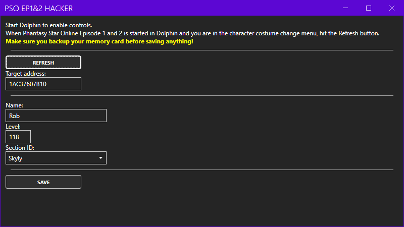

# PSO Hacker

This project is a very quick and dirty memory hacking tool for the game Phantasy Star Online Episode 1&2 for the Nintendo Gamecube, targeting specifically the European version, running on the Dolphin emulator.

It has simple controls to allow players to change some properties of their characters.

While the game is running and players are accessing the dressing room, the tool can be used to change the following:
- Character name
- Character level
- Character section ID

While in a single-player game, the tool can be used to change the following:
- Individual material use counts (allows you to use more than 150/250 materials)

It uses the MindControl library to interact with the memory of the game running through the Dolphin emulator.

Usage is simple and described on the interface.
